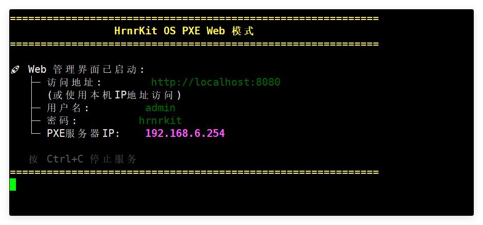
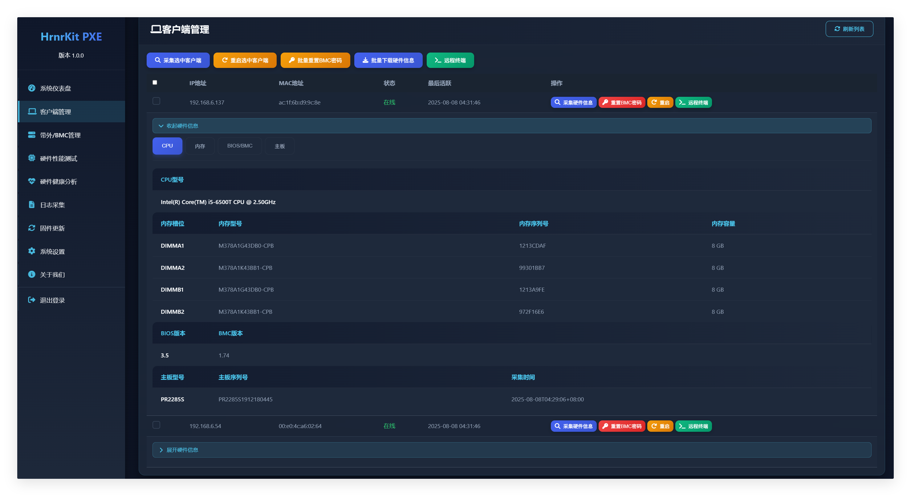
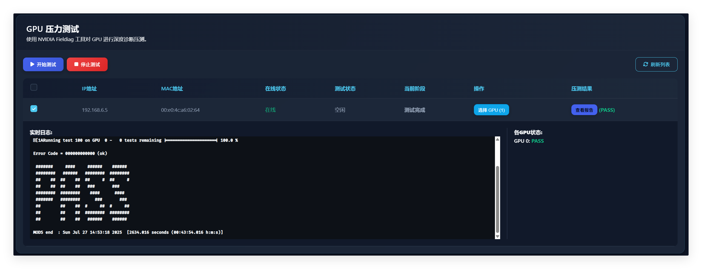
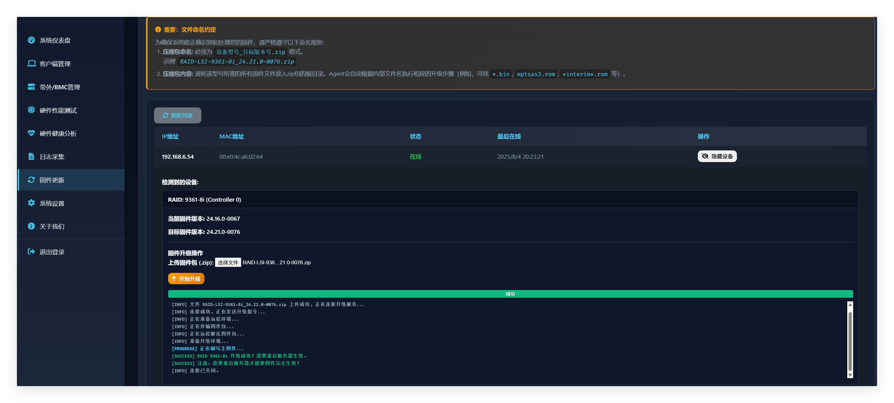

<!-- GitHub README.md for hrnr27/HrnrKitOS -->

  

<h1 align="center">HrnrKitOS v3.3.0</h1>

  <strong>面向一线运维工程师的免费全能 Linux 运维工具盘</strong> 
  一键 PXE 启动 · 全新 Web UI · 批量服务器运维

  
  
  
  

---

📑 目录

- [核心亮点](#核心亮点)
- [快速开始](#快速开始)
- [功能详解](#功能详解)
- [内置工具清单](#内置工具清单)
- [下载与校验](#下载与校验)
- [常见问题](#常见问题)
- [贡献与反馈](#贡献与反馈)

---

## 核心亮点
| 特性 | 简介 |
| --- | --- |
| 🖥️ **Web UI 管理平台** | 首次引入图形化界面，批量管理所有 PXE 客户端 |
| 🔧 **38+ 运维工具** | 覆盖存储 / 网络 / GPU / BMC / BIOS 等主流品牌 |
| 📊 **智能诊断** | 一键硬件健康检查、日志采集、压力测试 |
| 🚀 **GPU 支持** | 新增 NVIDIA GPU 驱动、日志采集与压力测试(fieldiag) |
| 🔌 **带外管理** | 远程开机 / 关机 / 重启 / PXE / BIOS |
| 🔄 **固件升级** | 支持 LSI / Broadcom 存储控制器固件在线升级 |

---

## 快速开始

### 1) 笔记本中部署（推荐）

1. 在笔记本/虚拟机中启动 `HrnrKit-System-3.3.0-x86_64.iso`  
   - 网卡1：NAT（上网）  
   - 网卡2：桥接（PXE 网络）
2. 浏览器访问 `http://<服务器IP>:8080` 即可进入 Web UI
3. 将目标服务器设为 PXE 启动，自动加载 HrnrKitOS 并上线
4. 终端执行 `/toolkit/HrkitStresk` 进入工具菜单

### 2) 服务器部署
- 启动后系统完全加载至内存，U 盘可拔除  
- 终端执行 `/toolkit/HrkitStresk` 进入工具菜单

---

## 功能详解

<b>1. 集中化 Web 管理界面</b>

- 实时监控客户端 IP / MAC / 在线状态  
- 批量重启、关机、信息采集  
- 内嵌 Web SSH 直连客户端  

<b>2. 远程运维操作能力</b>

- 一键硬件资产盘点（CSV 导出）  
- BMC 密码批量重置（支持 iLO / iDRAC / IPMI）  
- 远程电源 & 带外控制（PXE / BIOS / 重启 / 关机）  

<b>3. 深度硬件诊断与健康管理</b>

- 压力测试：CPU / 内存 / 硬盘 / 网络 / GPU  
- 健康分析：SMART / RAID / NIC / BMC  
- 一键日志采集（RAID / GPU / NIC / BMC）+ 关键字搜索  
- 生成标准 RMA 报告  

<b>4. 固件升级与维护</b>

- LSI / Broadcom 存储控制器固件在线升级  
- AMI BIOS 批量刷写（afu / afudos / afuefi）  

---

## 内置工具清单
> 共 38 个，按场景分类

| 类别 | 工具 |
| --- | --- |
| **存储管理** | `storcli64` `perccli64` `MegaCli64` `smartctl` `sas3flash` `sas2flash` `sas3ircu` `arcconf` |
| **网络配置** | `mlxconfig` `mstflint` `mlxfwmanager` `bnxtnvm` `bootutil64e` `Yafuflash` |
| **GPU 管理** | `nvidia-smi` `fieldiag` |
| **带外管理** | `ipmitool` `hponcfg` `ssacli` `smcipmitool` `racadm` |
| **诊断信息** | `dmidecode` `turbostat` `lshw` `nvme-cli` |
| **压力测试** | `stress-ng` `memtester` `fio` `iperf3` `fieldiag`|
| **BIOS/固件** | `fwupd` `afu` `afudos` `afuefi` |
| **其他** | `gdisk` `partclone` `ddrescue` |

---

## 下载与校验

| 渠道 | 链接 | 校验 |
| --- | --- | --- |
| **GitHub Releases** | [hrnr27/HrnrKitOS/tags](https://github.com/hrnr27/HrnrKitOS/tags) | SHA-256: `824623ee57290167f131d074a0b8737437a266cc8e7c192bc460b047eb20b02e` |
| **百度网盘** | [pan.baidu.com](https://pan.baidu.com/s/1KbVnL3QcYzq6I7MMeqwNjw) 提取码 `3bqf` | HrnrKit-System-3.3.0-x86_64.iso |

> 校验命令：`sha256sum HrnrKit-System-3.3.0-x86_64.iso`

---

## 常见问题

Q: 如何重置 BMC 密码？

A: 在 Web UI 选中目标主机 → 更多操作 → BMC 密码重置。目前支持 Dell、HPE、Supermicro、Lenovo 等主流品牌。

Q: 是否支持 UEFI 启动？

A: 支持 Legacy BIOS 与 UEFI 双模式启动。

---

## 贡献与反馈
- 📧 邮件：<support@hrnrkit.cn>（1-3 周内回复）  
- 🐛 Issue：[GitHub Issues](https://github.com/hrnr27/HrnrKitOS/issues)  
- 💡 PR：欢迎提交补丁、文档或新工具集成

---

  HrnrKitOS v3.3.0 — 让服务器运维更简单高效！

