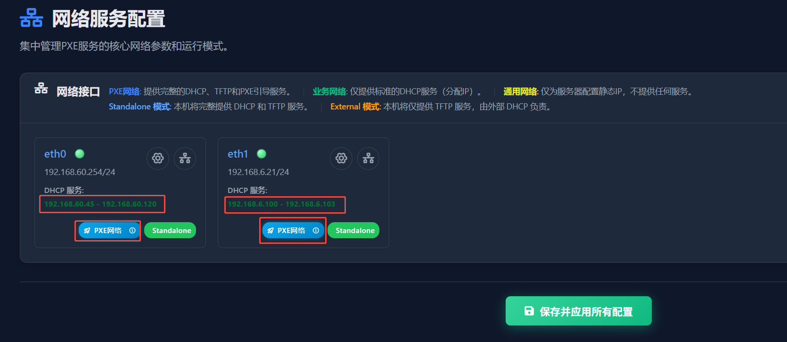
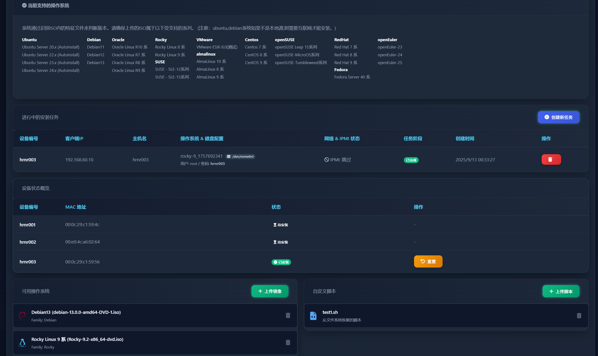
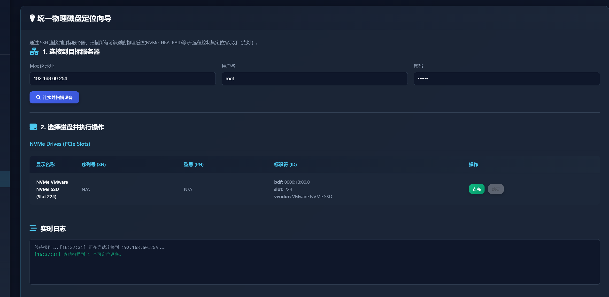

<!-- GitHub README.md for hrnr27/HrnrKitOS -->

  

<h1 align="center">HrnrKitOS PXE Nexus v3.3.2</h1>

  <strong>面向一线运维工程师的企业级裸金属自动化运维平台</strong> 
  一键 PXE 启动 · 自动化 OS 安装 · 物理磁盘定位 · 深度硬件诊断 · 跨机房网段启动

  
  
  
  

---

📑 目录

- [核心亮点](#-核心亮点)
- [快速开始](#-快速开始)
- [功能详解](#-功能详解)
- [内置工具清单](#-内置工具清单)
- [下载与校验](#-下载与校验)
- [常见问题](#-常见问题)
- [贡献与反馈](#-贡献与反馈)

---

## ✨ 核心亮点

| 特性 | 简介 |
|------|------|
| 🌐 **多网段并行完整服务**（全新） | **HrnrKit PXE Nexus** 采用接口独立设计，可在 **同一台主机** 上让多个物理网口/VLAN 同时成为 **全功能 PXE 服务器**。每个网段独享完整的 DHCP/TFTP/HTTP/DNS 服务栈，彼此物理隔离、零干扰，彻底告别“单网段+中继”带来的性能瓶颈与配置耦合。 🎯 **典型场景** ① **多机房并行装机**——A 机房走 10.10.1.0/24，B 机房走 10.20.1.0/24，一套 Nexus 即可同时为两地提供系统部署，无需额外 PXE 中继或跳转服务器。 ② **异构 VLAN 批量交付**——研发、测试、生产分别位于 VLAN100/200/300，各 VLAN 内的裸机可同步拉取不同 Kickstart/Preseed 模板，实现“一键三环境”并行交付。 ③ **高规隔离安全域**——生产网、带外管理网、实验网物理完全隔离，Nexus 通过多宿主方式同时服务，满足金融、电信等行业对“网络不可互通”合规要求。 |
| ⚙️ **自动化 OS 安装** | **(全新)** 支持 Kickstart/Preseed，模板化部署 RHEL/Ubuntu/SUSE |
| 💡 **物理磁盘定位** | **(全新)** 远程 Web 点灯，精准定位 SAS/SATA/NVMe 硬盘，告别拔错盘 |
| 🖥️ **Web UI 管理平台** | 集中化图形界面，实时监控与批量管理所有 PXE 客户端 |
| 🔬 **深度诊断与压测** | 一键硬件健康检查、日志采集、压力测试（CPU/内存/硬盘/GPU） |
| 🔌 **带外管理 (IPMI)** | 远程开/关机、重启、设置引导项（PXE/BIOS），实现零接触运维 |
| 🔧 **38+ 专业工具集** | 全面覆盖存储、网络、GPU、BMC、BIOS 等主流品牌控制器 |

---

## 🚀 快速开始

### 1) 笔记本/虚拟机中部署 (推荐)
1.  **启动 ISO**: 在 VirtualBox/VMware 中启动 `HrnrKit-System-v3.3.1-x86_64.iso`
    -   网卡1: NAT (用于访问互联网)
    -   网卡2: 桥接 (用于 PXE 客户端网络)
2.  **访问 Web UI**: 浏览器打开 `http://<服务器IP>:8080`
3.  **客户端上线**: 将目标服务器网卡设为 PXE 启动，即可自动加载 HrnrKitOS 并出现在 Web 界面
4.  **(可选) 命令行**: 终端执行 `/toolkit/HrnrkitStresk` 进入传统工具菜单

### 2) U盘/物理服务器部署
-   系统启动后完全加载至内存，U 盘可安全拔除
-   配置好网络后，即可作为 PXE 服务端使用

---

## 🛠️ 功能详解

### 3. 🌐 多网段并行完整服务（全新）

- **接口独立设计**：同一主机上任意物理网口/VLAN 均可同时成为「全功能 PXE 服务器」，各自独享 DHCP/TFTP/HTTP/DNS 服务栈，零交叉、零中继。
- **标签驱动配置**：
  - **PXE 网络**＝完整引导＋DHCP；可选 Standalone（独立地址池）或 External DHCP（现网已有 DHCP，仅提供 TFTP+iPXE 链式引导）。
  - **业务网络**＝仅分配 IP；不响应 PXE。
  - **通用网络**＝仅给本机设静态 IP，不对外服务。
- **Standalone 模式一键地址池**：可视化创建/删除多个不重叠地址池，即时生效。
- **External DHCP 模式向导**：自动生成 Dnsmasq/ISC-DHCP/Windows DHCP 配置片段，复制即用，5 分钟完成现网注入。
- **多网卡/IP 别名支持**：单口可绑定多 VLAN 子接口，轻松扩展至 10+ 网段。

🎯 **典型场景**  
① **多机房并行装机**——A 机房 192.168.60.0/24，B 机房 192.168.61.0/24，两条网线接入同一台 Nexus，即可同时为两地提供完整 PXE 安装，无需额外中继或跳转服务器。  
② **异构 VLAN 批量交付**——研发/测试/生产分别位于 VLAN100/200/300，各 VLAN 裸机同步拉取不同 Kickstart/Preseed 模板，实现「一键三环境」并行交付。  
③ **高规隔离安全域**——生产、带外、实验三网物理隔离，Nexus 多宿主同时服务，满足金融、电信等行业「网络不可互通」合规要求。

### 1. ⚙️ 企业级自动化 OS 安装

-   **模板化部署**: 支持主流操作系统 (RHEL/CentOS, Ubuntu/Debian, SUSE) 的 Kickstart, Preseed/Autoinstall 模板。
-   **Web 流程驱动**: 从 ISO 上传、模板管理、任务创建到进度监控，全程 Web 化，实现无人值守安装。
-   **IPMI 自动引导**: 深度集成带外管理，可自动远程开机并引导服务器进入 PXE 安装流程。
-   **安装后脚本 (Post-install)**: 自动执行初始化脚本，完成主机名、网络、软件源等配置。
-   **交互式磁盘配置**: 在安装前，通过 Web 界面为服务器直观地选择安装目标盘。

### 2. 💡 物理磁盘定位 (Web 点灯)
 <!-- 提示：请替换为真实截图 -->
-   **精准映射**: 自动关联 Linux 块设备 (`/dev/sdX`) 与其物理**插槽号 (Slot)** 和**序列号 (SN)**。
-   **统一操作**: 抽象化硬件厂商底层命令，提供统一的“点亮/熄灭”按钮，屏蔽硬件差异。
-   **支持异构存储**: 无论是 RAID 卡后的 SAS/SATA 盘，HBA 直通卡，还是主板直连的 NVMe 盘，都能被准确识别并点亮。

### 3. 🖥️ 集中化 Web 管理

-   **实时监控**: 客户端 IP / MAC / 在线状态一目了然。
-   **批量操作**: 支持对在线客户端执行统一的重启、关机、信息采集等任务。
-   **带外管理 (OOB)**: 集成强大的 IPMI 功能，实现远程开关机、设置引导项等“零接触”操作。
-   **设备信息管理**: 支持批量导入服务器编号、MAC 及 IPMI 凭证，简化设备初始化流程。

### 4. 🔬 深度硬件诊断与健康分析

-   **压力测试套件**: 提供 CPU, 内存, 硬盘, 网络, GPU 的专业压力测试，支持实时监控和 PDF 报告导出。
-   **智能健康分析**: 深入解读硬盘 SMART、RAID 卡事件、网卡状态和 BMC 日志，提前预警潜在故障。
-   **一站式日志采集**: 一键打包所有关键组件 (RAID/GPU/HBA/NIC/BMC) 的日志，加速故障排查。

### 5. ⬆️ 固件升级与维护

-   **存储控制器升级**: 支持 LSI/Broadcom RAID 卡和 HBA 卡固件在线升级，提供实时进度反馈。
-   **BIOS 工具集**: 内置 AMI BIOS 刷写工具 (`afu`, `afudos`, `afuefi`)，满足主板维护需求。

---

## 🧰 内置工具清单
> 共 38+ 个，按场景分类

| 类别 | 工具 |
| --- | --- |
| **存储管理** | `storcli64`, `perccli64`, `MegaCli64`, `smartctl`, `sas3flash`, `sas2flash`, `sas3ircu`, `arcconf` |
| **网络配置** | `mlxconfig`, `mstflint`, `mlxfwmanager`, `bnxtnvm`, `bootutil64e`, `Yafuflash` |
| **GPU 管理** | `nvidia-smi`, `fieldiag` |
| **带外管理** | `ipmitool`, `hponcfg`, `ssacli`, `smcipmitool`, `racadm` |
| **诊断信息** | `dmidecode`, `turbostat`, `lshw`, `nvme-cli` |
| **压力测试** | `stress-ng`, `memtester`, `fio`, `iperf3`, `fieldiag`|
| **BIOS/固件** | `fwupd`, `afu`, `afudos`, `afuefi` |
| **其他** | `gdisk`, `partclone`, `ddrescue` |

---

## 📥 下载与校验

| 渠道 | 链接 | 校验信息 |
| --- | --- | --- |
| **GitHub Releases** | [hrnr27/HrnrKitOS/tags](https://github.com/hrnr27/HrnrKitOS/tags) | SHA-256: `1a8bb9177f5af734e23dfcba152a972b5a65474db4e1f7dbe16beec68fd26c20` |
| **百度网盘** | [pan.baidu.com](https://pan.baidu.com/s/1KbVnL3QcYzq6I7MMeqwNjw) 提取码 `3bqf` | HrnrKit-System-v3.3.1-x86_64.iso |

> **校验命令:** `sha256sum HrnrKit-System-v3.3.1-x86_64.iso`

---

## ❓ 常见问题

Q: 这个工具是免费的吗？

A: 是的，HrnrKitOS 对个人和商业用途完全免费。

Q: 如何重置 BMC 密码？

A: 在 Web UI 选中目标主机 → 更多操作 → BMC 密码重置。目前支持 Dell, HPE, Supermicro, Lenovo 等主流品牌。

Q: 是否支持 UEFI 启动？

A: 支持 Legacy BIOS 与 UEFI 双模式启动。

---

## 🤝 贡献与反馈
- 📧 **邮件**: <support@hrnrkit.cn> (1-3 周内回复)
- 🐛 **Issue**: 发现 Bug 或有功能建议？请到 [GitHub Issues](https://github.com/hrnr27/HrnrKitOS/issues) 提交。
- 💡 **PR**: 欢迎提交代码补丁、文档改进或新工具集成！

---

  HrnrKitOS PXE Nexus — 让裸金属服务器运维更简单、更智能、更高效！

