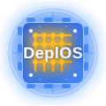

  

<h1 align="center">DeplOS_v1.3.5</h1>

  <strong>新一代数据中心裸金属自动化运维平台</strong> 
  自动化交付编排 · 黑灯工厂模式 · 全栈硬件感知 · 离线镜像仓库

> 
<strong>序阵 · Deploy OS</strong> — 让每一次部署，都井然成阵。

  
  
  
  
  

<b>📑 目录 (Table of Contents)</b>

- [项目简介](#-项目简介)
- [v1.3.5 更新亮点](#-v135-更新亮点-whats-new)
- [v1.3.4 更新亮点](#-v134-更新亮点-whats-new)
- [v1.3.3 更新亮点](#-v133-更新亮点-whats-new)
- [核心特性](#-核心特性)
- [支持列表](#-支持列表)
- [快速开始](#-快速开始)
- [功能概览](#-功能概览)
- [下载与更新](#-下载与更新)
- [社区与支持](#-社区与支持)

---

## 📖 项目简介

**DeplOS** 是一套专为大规模数据中心设计的全生命周期运维平台。它无需依赖复杂的带外网络，通过 **PXE 自动化技术**，实现了从设备自动发现、系统无人值守安装、全栈硬件监控到故障自愈的完整闭环。

---

## 🎉 v1.3.5 更新亮点 (What's New)

> [!NOTE]
> **版本建议：** 本次更新带来了对主流虚拟化平台（ESXi/PVE/KVM）的重磅支持，并全面重构了本地客户端工具链。同时，针对硬 RAID 存储、性能压测报告、用户安全审计及国产网卡引导进行了全方位深度调优。推荐所有用户尽快升级。

### 🖥️ 虚拟化与本地运维
- **新增 虚拟化平台深度适配**：资产管理模块全面升级，正式引入对 **ESXi / PVE / KVM** 等主流虚拟化平台的管理；支持虚拟机的自动拉取、创建、编辑、开关机控制及 PCI 设备直通（Passthrough）配置。
- **新增 本地客户端直调**：推出本地专属客户端调用助手，支持直接从 Web 控制台**一键唤起本地原生的 RDP（远程桌面）与 SSH 客户端**，免去繁琐的安全授权与手动输入。

### ⚙️ 底层性能与系统管理
- **优化 性能压测可视化**：深度调优 CPU、内存、存储及 NVIDIA GPU 压力测试引擎，**压测报告首度引入动态折线图分析看板**，直观呈现压测期间的硬件性能曲线与热指标波动。
- **优化 客户端状态看板**：优化 deplOS PXE 客户端（Agent）看板，新增资产编号（Asset Tag）、系统架构（x86_64 / ARM64）、物理厂商及精确 CPU 规格等维度的直观展示。
- **优化 细粒度权限控制**：升级用户角色权限控制（RBAC）模型，引入更细粒度的操作权限划分，提升多租户、多管理员场景下的系统安全性与灵活性。
- **优化 国产网卡 PXE 兼容性**：深度优化 DHCP 外部中继模式的报文应答逻辑，显著增强对主流信创/国产网卡（如飞腾、海光配套网卡）PXE 阶段的引导兼容性。
- **优化 磁盘定位与镜像同步**：优化物理磁盘定位（Locate LED）与闪烁点灯机制，提升维护效率；重构镜像源站管理模块的分发架构，缩短大文件同步耗时。

### 🐞 问题修复与稳定性提升
- **修复 存储与 RAID 阵列**：修复在特定硬 RAID 卡及 HBA 直通卡上，无法正常读取、构建 RAID 阵列及更改磁盘模式的配置异常。
- **修复 监控及日志采集**：修复硬件监控模块的偶发异常，优化资源开销；修复日志一键打包收集器在遭遇超大文件或磁盘只读时的中断问题。
- **修复 自动化部署异常**：修复新机入库流程中，Windows 系统自动分发安装、ESXi 系统 PXE 自动化部署，以及部分机型在虚拟机实例分发阶段的调度异常。
- **修复 资源发现与带外管理**：修复在线设备扫描探测时的入库失败问题；修复 IPMI 批量管理工具（如并发凭据轮转、状态超时）的已知缺陷，大幅优化多并发指令下的执行效率。

---

## 🎉 v1.3.4 更新亮点 (What's New)

本次更新重点重构了新机入库的核心流程，并对多个系统模块进行了深度优化与修复，显著提升了硬件交付的稳定性与兼容性。

### 🏗️ 交付编排与效率
- **重构 新机入库流程**：重构编排任务与自动扫描逻辑，优化设备识别与信息同步机制，大幅提升大规模设备入库的流程稳定性与成功率。
- **优化 RAID 配置向导**：优化存储配置模块，简化配置步骤，增强对主流 RAID 控制器的兼容性与配置可靠性。
- **升级 PXE 安装模块**：为关键操作节点新增**流程可视化展示**，帮助用户清晰掌握安装进度；增强 PXE 网络协议栈，提升在复杂网络环境下的适配能力。

### 🛠️ 底层能力与兼容性
- **优化 PXE 客户端系统**：提升 deplOS PXE 客户端在异构硬件平台上的运行效率与资源调度能力。
- **增强 带外管理**：优化 BMC/IPMI 管理模块，提升与服务器的连接稳定性及指令响应速度。
- **完善 固件配置**：优化 BIOS/UEFI 配置管理模块，提升配置项读取与写入的准确性与可靠性。

### 🚨 系统稳定性与修复
- **修复 系统部署 (Ubuntu)**：修复在自动化编排任务中，Ubuntu 系统安装流程可能中断的关键问题。
- **修复 系统部署 (Windows)**：修复 PXE 模块安装 Windows Server 操作系统时出现的部署失败问题。
- **修复 监控服务**：解决硬件健康监控模块因日志轮转机制异常，导致监听进程资源占用过高的问题。
- **修复 系统稳定性**：修复其它若干影响系统稳定性的已知问题，提升整体健壮性。

---

## 🎉 v1.3.3 更新亮点 (What's New)

> [!CAUTION]
> **特别提示（升级必读）**
> - **项目更名**：项目从 `hrnros` 正式重命名为 `deplos`，涉及全局配置与脚本路径变更，请务必检查相关依赖。
> - **端口变更**：服务端口由 `8080` 调整为 `9100`，以避免与用户环境中的常见端口冲突，请相应调整防火墙及反向代理配置。
>
> **重要说明**：此次更新涉及项目重命名、端口变更及内核升级，建议在维护窗口期操作，并提前备份配置文件。

### 🛠️ 底层能力与兼容性
- **升级 系统内核**：同步升级 deplOS x86_64 及 ARM64 架构的内核版本，全面提升系统稳定性和硬件兼容性。
- **优化 NVIDIA GPU 驱动**：适配更多 GPU 型号，增强诊断测试模块的准确性。
- **更新 GPU Fieldiag 支持**：新增对 NVIDIA H 系列、B 系列显卡的支持。

### 🏷️ 项目与基础设施
- **项目重命名**：将项目从 `hrnros` 正式重命名为 `deplos`。
- **服务端口变更**：为避免端口冲突，服务端口从 `8080` 修改为 `9100`。

### 🏗️ 交付编排与效率
- **优化 BMC 信息处理**：优化入库编排任务，以用户导入的 BMC 信息为准，若信息正确则直接采用，不再进行修改。

### 🔒 系统安全
- **系统安全加固**：优化并修复了多个系统安全隐患，提升整体安全性。

---

## ✨ 核心特性

| 模块 | 亮点功能 |
| :--- | :--- |
| **📦 资产 CMDB** | **自动发现/BOM比对**。深度采集硬件 BOM 清单，支持虚拟化实例自动拉取与全链路操作审计。 |
| **🏗️ 交付编排** | **自动化流水线**。串联 **BMC 默认强制配置** 与 RAID 组建，实现"点亮即交付"。 |
| **🚀 PXE 自动化** | 支持 RHEL/Windows/信创全系。**优先离线 ISO 安装**，支持可视化 RAID/Bond 配置。 |
| **🩺 Nexus 监控** | **全栈感知**。实时透视 ECC/SMART/GPU 状态，采用最新架构强化故障分析闭环。 |
| **🛠️ 系统运维** | **Web 级控制台**。集成 WebSSH/RDP，支持**一键拉起本地原生客户端**，深度集成 ESXi/PVE 虚拟机运维。 |
| **🧪 算力压测** | **深度质量控制**。涵盖 GPU、CPU、内存、存储压力测试，生成**内嵌折线图趋势**的专业压测报告。 |
| **🌐 弹药库** | **私有镜像站**。管理本地 ISO 与软件包同步，支持多网段隔离环境下的快速装机。 |

---

## ✅ 支持列表

DeplOS 支持主流及信创操作系统（x86_64 及 ARM64 架构）：

| 家族 | 支持版本 |
| :--- | :--- |
| ** RHEL 系** | RedHat 7/8/9, CentOS 7/8/9, AlmaLinux, Rocky Linux, Oracle Linux |
| ** Windows** | Server 2008/2012/2016/2019/2022/2025, Windows 10/11 |
| **🇨🇳 国产信创** | openEuler 23/24/25, Anolis 7/8/23, Kylin V10+, UOS, BClinux, CtyunOS, TencentOS |
| ** Debian 系** | Ubuntu 20.04/22.04/24.04 LTS (**离线安装模式**), Debian 11/12/13 |
| ** 虚拟化** | **VMware ESXi、Proxmox VE (PVE)、KVM (支持虚拟机拉取与状态管控)**, SUSE SLE 12/15 |

---

## 🚀 快速开始

### 1. 获取安装包
~~~bash
wget https://github.com/hrnr27/DeplOS/releases/download/v1.3.5/deplos_install_v1.3.5.tar.gz
tar -zxvf deplos_install_v1.3.5.tar.gz
cd deplos_install_v1.3.5/
~~~

### 2. 一键安装
~~~bash
sudo ./install
~~~

### 3. 访问控制台
通过浏览器访问：`http://<服务器IP>:9100` (默认账号/密码：`admin`/`hrnrkit`)

---

## 🧩 功能概览

### 1. 全栈硬件监控 (Nexus Monitor)
具备自我感知能力的监控大屏。以真实故障场景经验为指导，强化了 GPU 显存及硬件微损场景的深度分析能力，保障服务高吞吐稳定运行。

### 2. 自动化交付流水线 (Delivery Orchestration)
为大规模裸金属设计的"交付指挥部"。自动串联：**BOM比对 -> BMC强制策略配置 -> RAID组建 -> 硬件多维度压测 -> 自动生成报告 -> 离线OS安装**。

### 3. 自动化 OS 安装 (Visual Config)
告别盲装。安装前自动扫描物理磁盘，支持可视化配置 RAID (0/1/5/10) 及网络 Bond 模式。**针对信创环境优化，移除在线源，默认采用 ISO 离线模式。**

### 4. GPU 深度压力测试 (GPU Stress Test)
针对 HPC 与 AI 算力集群设计。对显卡计算核心及显存颗粒执行高强度验证，支持显存泄漏排查及极限稳定性评估，**报告首度支持动态性能折线图渲染**。

### 5. 高效系统运维 (System Ops)
集成 WebSSH 终端与批量脚本控制台。**支持从 Web 页面一键直接唤起本地原生 RDP 及 SSH 运行环境**，并具备对 **ESXi、PVE、KVM 虚拟机**的直接管控与运维能力。

### 6. 物理磁盘定位 (Disk Locator)
无需安装 Agent，直接通过底层指令点亮 LED 灯，支持 **NVMe、RAID 及 HBA 直通盘**，解决现场运维拔错盘的痛点。

---

## 📥 下载与更新

| 版本类型 | 说明 | 下载链接 |
| :--- | :--- | :--- |
| **📦 Full (全量包)** | 包含完整依赖与基础镜像，适用于**全新离线安装**。 | [GitHub Release](https://github.com/hrnr27/DeplOS/releases) |
| **⚡ Update (更新包)** | 仅包含核心程序与 Web 资源，适用于 v1.x **平滑升级**。 | [GitHub Release](https://github.com/hrnr27/DeplOS/releases) |

---

## 💬 社区与支持

- **官方 QQ**: `759419595`
- **微信公众号**: `Linux客栈`
- **邮件支持**: <support@hrnrkit.cn>

  Made with ❤️ by DeplOS Team. 赋能数据中心智能运维。

